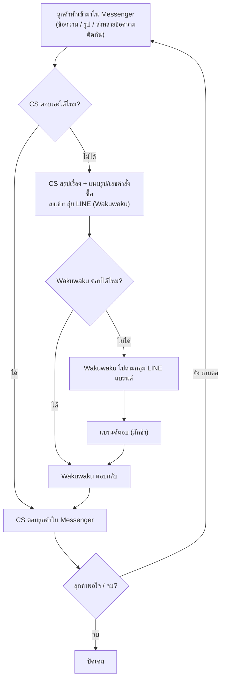
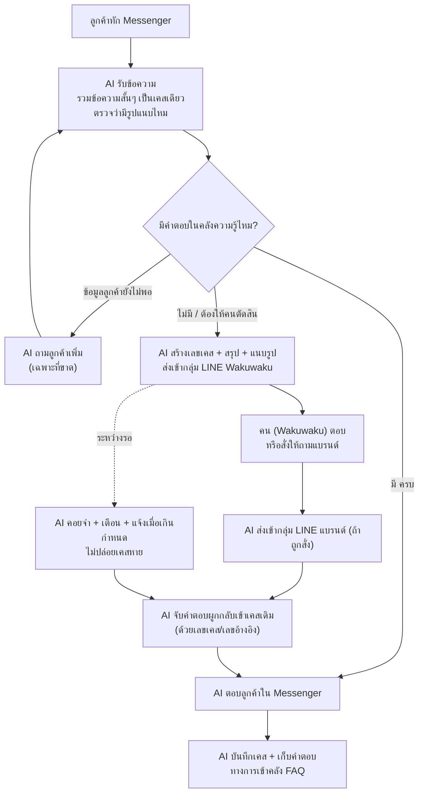

# CSC-PJ — ระบบ AI ตอบแชทลูกค้า (Tulip Customer Service)

เอกสารนี้อธิบายว่า **ระบบ AI ตอบแชทลูกค้าจะทำงานยังไง** อะไรทำได้ อะไรทำไม่ได้ อะไรยังไม่แน่ พร้อมทางแก้และวิธีนำเสนอ
เขียนจากข้อมูลจริงที่วิเคราะห์แล้ว: แชท Facebook Messenger ของเพจ Tulip + กลุ่ม LINE 2 กลุ่ม (CS×Wakuwaku และ Tulip×Wakuwaku)

> สถานะ: เอกสารวางแผน/ศึกษาความเป็นไปได้ — **ยังไม่ใช่ระบบที่สร้างเสร็จ และยังไม่ใช่การตัดสินใจลงมือสร้าง**
> อัปเดต: 2026-09-17

---

## สารบัญ

1. [เรื่องนี้คืออะไร (แบบสั้น)](#1-เรื่องนี้คืออะไร-แบบสั้น)
2. [ตอนนี้ทำงานกันยังไง (flow ปัจจุบัน)](#2-ตอนนี้ทำงานกันยังไง-flow-ปัจจุบัน)
3. [ถ้ามี AI จะทำงานยังไง (flow ใหม่)](#3-ถ้ามี-ai-จะทำงานยังไง-flow-ใหม่)
4. [อะไรทำได้ / อาจจะได้ / อาจจะไม่ได้ / ทำไม่ได้](#4-อะไรทำได้--อาจจะได้--อาจจะไม่ได้--ทำไม่ได้)
5. [จุดเสี่ยงสำคัญ + ทางแก้ละเอียด](#5-จุดเสี่ยงสำคัญ--ทางแก้ละเอียด)
6. [สิ่งที่ต้องขอเพิ่มก่อนเริ่ม](#6-สิ่งที่ต้องขอเพิ่มก่อนเริ่ม)
7. [ทางนำเสนอ (เสนอทีม / เสนอแบรนด์)](#7-ทางนำเสนอ-เสนอทีม--เสนอแบรนด์)
8. [ข้อควรระวังเรื่องข้อมูล](#8-ข้อควรระวังเรื่องข้อมูล)

---

## 1. เรื่องนี้คืออะไร (แบบสั้น)

ทุกวันนี้มี **พนักงาน CS (จ้างข้างนอก) 1 คน** คอยนั่งตอบแชทลูกค้าในเพจ Facebook ของ Tulip
- ลูกค้าถามอะไร ตอบได้ก็ตอบเลย
- ตอบไม่ได้ ก็ไปถามในกลุ่ม LINE (ถาม Wakuwaku ก่อน แล้ว Wakuwaku ไปถามแบรนด์) แล้วเอาคำตอบกลับมาบอกลูกค้า

**ไอเดียของโปรเจกต์นี้: เอา AI มาทำหน้าที่ "คนกลาง" นี้แทน** — วิ่งเรื่องแบบเดิม แต่ตอบเร็วกว่า ทำ 24 ชม. ไม่ทำเคสหาย และจำคำตอบไว้ใช้ซ้ำ

**คุณค่าจริง 2 ข้อ** (จากปัญหาที่เห็นในแชทจริง):
1. **ตอบคำถามซ้ำๆ ให้อัตโนมัติ** — เช่น "ราคาเท่าไหร่" "ซื้อที่ไหน" "มีที่ Shopee ไหม" คำถามพวกนี้ตอบเหมือนเดิมทุกครั้ง
2. **ไม่ปล่อยให้เคสลูกค้าหาย** — เราเห็นเคสจริงที่ลูกค้าถามเรื่องบัตร/ของรางวัลแล้วต้องตามซ้ำๆ หลายวัน (*"ได้เรื่องยัง" "รอนานไหม"*) เพราะเรื่องค้างอยู่กับคน

---

## 2. ตอนนี้ทำงานกันยังไง (flow ปัจจุบัน)

อิงจากแชทจริง เส้นทางเป็นแบบนี้:

**รายละเอียดแต่ละขั้น (จากที่เห็นจริง):**

| ขั้น | เกิดอะไรขึ้น | ตัวอย่างจริงที่เจอ |
| --- | --- | --- |
| 1. ลูกค้าทัก | ถามข้อมูล/สั่งซื้อ/แจ้งปัญหา บางทีส่งข้อความสั้นหลายอันติดกัน หรือส่งรูป | "ราคาส่งมีไหม", "ทิวลิปอีอีเกรซเลิกผลิตแล้วหรอ", ส่งรูปสินค้ามาถามว่ามีขายไหม |
| 2. CS ตอบเอง | เรื่องที่รู้อยู่แล้ว ตอบเลย | ราคา, ช่องทางซื้อ (ส่งลิงก์ Shopee/Lazada), ข้อมูลสินค้า |
| 3. CS ส่งขึ้น LINE | เรื่องที่ตอบเองไม่ได้ สรุปแล้วส่งเข้ากลุ่ม CS×Wakuwaku พร้อมเลขอ้างอิง | เคสบัตร TrueMoney สแกนไม่ได้, เคสของรางวัล, เช็คสต็อก |
| 4. Wakuwaku / แบรนด์ | Wakuwaku ตอบเอง หรือไปถามแบรนด์ต่อ | "ขอปรึกษาแบรนด์ก่อนนะคะว่าจะตอบยังไง" |
| 5. ตอบกลับลูกค้า | เอาคำตอบมาพิมพ์ตอบใน Messenger | — |
| 6. ระหว่างรอ | ลูกค้ามักทวงถาม CS ตอบว่า "รอฝ่ายที่เกี่ยวข้องอัปเดต" | ลูกค้าถาม *"นานไหมครับ"* → *"เหมือนรอ ไม่มีกำหนดเลย"* |

**ข้อค้นพบสำคัญจากข้อมูลจริง:**

- ✅ **เคสข้ามช่องทางเชื่อมกันได้ด้วย "เลข"** — เลขบัตร (เช่น 48514xxx) และเลขพัสดุ (เช่น RN646xxxxxxTH) ที่เห็นใน Messenger ไปโผล่ในกลุ่ม LINE เป๊ะๆ → แปลว่าเราตามเรื่องเดียวข้าม 3 ช่องทางได้จริง
- ✅ **กลุ่ม LINE 2 กลุ่มทำหน้าที่ต่างกัน**
  - **CS×Wakuwaku** = สายแก้ปัญหาลูกค้าจริง (บัตร/ของรางวัล/พัสดุ/การแลกของ) — คุยกันเรื่องนี้เยอะมาก
  - **Tulip×Wakuwaku (แบรนด์)** = สายประสานงานแคมเปญ/คอนเทนต์เป็นหลัก เรื่องลูกค้ารายวันแทบไม่ขึ้นถึงตรงนี้
- ⚠️ **จุดเจ็บที่ชัดที่สุด** = เคสที่ต้องรอแบรนด์ตอบ แล้วลากยาวหลายวัน ลูกค้าตามซ้ำ

---

## 3. ถ้ามี AI จะทำงานยังไง (flow ใหม่)

AI จะเข้ามาแทน "คนกลาง" ในขั้น 2–6 โดยคนยังอยู่ในระบบ (Wakuwaku/แบรนด์) แต่เฉพาะตอนที่ต้องตัดสินใจจริงๆ

**หัวใจของ flow ใหม่:**
- **คน = คนตัดสินใจ** (Wakuwaku/แบรนด์ตอบเฉพาะเรื่องที่ AI ตอบเองไม่ได้)
- **AI = คนวิ่งเรื่อง** (รับ เข้าใจ ตอบซ้ำ ส่งต่อ ตามงาน ผูกเรื่อง ตอบกลับ จำ)
- งานที่ตอนนี้คนทำแล้วเสียเวลา — คัดลอกคำตอบไปมา ส่งรูปซ้ำ ตามเรื่องที่ค้าง — AI ทำแทน

---

## 4. อะไรทำได้ / อาจจะได้ / อาจจะไม่ได้ / ทำไม่ได้

แบ่งเป็น 4 ระดับตามความมั่นใจ พร้อมทางแก้

### 🟢 ทำได้แน่ (เทคโนโลยีมาตรฐาน ไม่ต้องลุ้น)

| ความสามารถ | ทำไมมั่นใจ |
| --- | --- |
| รับข้อความ Messenger ทันทีที่เข้ามา | Facebook มี webhook ให้ใช้เป็นมาตรฐาน |
| ตอบคำถามซ้ำจากคลังความรู้ (ราคา/ช่องทาง/ข้อมูลสินค้า) | คำถามแบบนี้ตอบเหมือนเดิม เห็นในแชทจริงเยอะ |
| รวมข้อความสั้นๆ ที่ลูกค้าพิมพ์ติดกัน ให้เป็นเคสเดียว | เป็นงานประมวลผลข้อความปกติ |
| จำแนกประเภทคำถาม (ราคา / ซื้อที่ไหน / เคลม / ขายส่ง ฯลฯ) | ทำได้ดี |
| ถามข้อมูลเพิ่มเมื่อลูกค้าให้มาไม่พอ | เช่น "ขอชื่อ-เบอร์-ที่อยู่" (CS ก็ทำแบบนี้อยู่แล้ว) |
| จำสถานะเคส + คิวที่รอตอบ + เตือนเมื่อค้างนาน | เป็นงานฐานข้อมูล ไม่ใช่งาน AI |
| ส่งข้อความ/รูป เข้ากลุ่ม LINE | LINE มี API ส่งข้อความให้ |
| ผูกเคสข้ามช่องทางด้วยเลขคำสั่งซื้อ/บัตร/พัสดุ | **พิสูจน์แล้วจากข้อมูลจริง** (เลขตรงกันข้าม Messenger↔LINE) |
| เก็บคำตอบทางการเป็นคลัง FAQ ไว้ใช้ซ้ำ | ทำได้ |

### 🟡 อาจจะได้ (หลักการมี แต่ต้องทดสอบจริงก่อน / มีเงื่อนไข)

| ความสามารถ | ติดตรงไหน | ทางแก้ |
| --- | --- | --- |
| **ส่งรูปจาก Messenger เข้า LINE อัตโนมัติ** (ไม่ต้องให้คนโหลด-ส่งเอง) | หลักการทำได้ แต่ยังไม่ทดสอบบนบัญชี Tulip จริง + ลิงก์รูปของ Facebook หมดอายุเร็ว | ทดสอบบนบัญชีจริง 1 รอบ + ออกแบบให้ระบบ "โหลดรูปเก็บทันที" ที่รับมา |
| **จับคำตอบใน LINE (ที่ไม่มีเลขเคส) ผูกกลับเข้าเคสถูกอัน** | คนใน LINE ไม่ได้ใส่เลขเคสทุกครั้ง | บังคับให้ AI ใส่เลขเคสตอนถาม + ใช้ฟีเจอร์ "ตอบกลับข้อความ" ของ LINE + ถ้าไม่ชัดให้ถามยืนยัน |
| **ให้ AI อ่าน/เข้าใจรูป (วิเคราะห์ภาพ)** | ทำได้ แต่มีต้นทุน และไม่จำเป็นทุกเคส | ค่าเริ่มต้น **ไม่**วิเคราะห์ภาพ — ใช้คำบรรยายของลูกค้าเป็นหลัก วิเคราะห์เฉพาะเคสที่คุ้มจริง |
| **ถอดเสียง / อ่านวิดีโอ** | ทำได้ แต่ต้องดูว่ามีจริงแค่ไหน | ดูปริมาณจริงจากประวัติก่อน ค่อยตัดสินว่าต้องทำไหม |
| **ดึงประวัติ Messenger เก่าผ่านระบบ** | ได้บางส่วน ขึ้นกับสิทธิ์เพจ + รูปเก่าลิงก์หมดอายุ | ใช้ควบคู่กับการ capture ด้วยมือ (แบบที่ทำมาแล้ว) |

### 🟠 อาจจะไม่ได้ (เสี่ยงสูง ต้องเช็ก/ขออนุญาตก่อน — ถ้าไม่ผ่าน ต้องเปลี่ยนวิธี)

| ความสามารถ | ทำไมเสี่ยง | ทางแก้ / แผนสำรอง |
| --- | --- | --- |
| **ตอบ Messenger อัตโนมัติ เมื่อแบรนด์ตอบช้าเกิน 24 ชม.** | Facebook มีกฎ: หลังลูกค้าเงียบเกิน 24 ชม. ห้ามส่งข้อความทั่วไปหาลูกค้าอีก (กันสแปม) → เคสที่รอแบรนด์นานอาจ **"เขียนคำตอบได้ แต่ส่งไม่ได้"** | ใช้ "ป้ายข้อความ" ที่ Facebook อนุญาต (message tag เช่น HUMAN_AGENT / อัปเดตหลังการซื้อ) / หรือให้คนกดส่งในเคสที่เกินกรอบ / หรือชวนลูกค้าตอบกลับเพื่อเปิดหน้าต่างใหม่ — **ต้องเช็กกฎล่าสุดก่อนเป็นอันดับแรก** |
| **เอา bot เข้ากลุ่ม LINE ที่มี bot อื่นอยู่แล้ว** | 1 กลุ่ม LINE ใส่ Official Account ได้แค่ 1 ตัว | เช็กก่อนว่ากลุ่มมี OA อื่นอยู่ไหม ถ้ามี ต้องคุยว่าจะใช้ตัวไหน หรือตั้งกลุ่มใหม่ |
| **ดึงประวัติแชตกลุ่ม LINE เก่าผ่านระบบ** | LINE **ไม่มี** ช่องทางให้ดึงย้อนหลัง | ใช้ไฟล์ export จากแอปด้วยมือ (แบบที่มีอยู่แล้ว) + ให้ระบบเก็บของใหม่ตั้งแต่วันเริ่ม |

### 🔴 ทำไม่ได้ / ไม่ควรให้ AI ทำ (ต้องเป็นคนเท่านั้น)

| เรื่อง | เหตุผล |
| --- | --- |
| ทำให้แบรนด์ตอบเร็วขึ้น | คอขวดอยู่ที่คนของแบรนด์ ไม่ใช่ระบบ — AI ทำได้แค่จัดคิว/เตือน |
| ตัดสินเรื่องที่แบรนด์เท่านั้นรู้ (สต็อก, ของเลิกผลิต, การชดเชย, เงื่อนไขพิเศษ) | ข้อมูลไม่ได้อยู่ในระบบ + เป็นการผูกพันธ์ทางธุรกิจ |
| ยืนยันข้อเท็จจริงแทนแบรนด์ (เช่น ตัดสินว่าของเสียเพราะอะไร) | ต้องให้แบรนด์ตัดสิน AI ทำได้แค่ "เล่าตามที่ลูกค้าแจ้ง" |
| รับปากเงื่อนไข/ส่วนลด/ชดเชย เอง | เสี่ยงสร้างข้อผูกมัดที่ผิด |

---

## 5. จุดเสี่ยงสำคัญ + ทางแก้ละเอียด

### เสี่ยง #1 — "เขียนคำตอบได้ แต่ส่งไม่ได้" (กรอบเวลา 24 ชม. ของ Messenger)
นี่คือ **จุดชี้เป็นชี้ตายของทั้งระบบ** เพราะเคสที่ต้องรอแบรนด์มักเกิน 24 ชม.
- **ทางแก้:**
  1. เช็กกฎล่าสุดของ Facebook เรื่องหน้าต่าง 24 ชม. + ป้ายข้อความที่อนุญาต **ก่อนเริ่มพัฒนา**
  2. เคสที่คาดว่ารอนาน → รีบขอข้อมูลลูกค้าให้ครบตั้งแต่ต้น + แจ้งลูกค้าว่า "จะติดต่อกลับ" เพื่อให้ลูกค้าตอบ (เปิดหน้าต่างใหม่)
  3. เคสที่เกินกรอบจริง → ให้คนเป็นคนกดส่ง หรือใช้ช่องทางอื่น (เช่น โทร) — ไม่ฝืนส่งอัตโนมัติ

### เสี่ยง #2 — คำตอบใน LINE ผูกกลับเข้าเคสผิด
- **ทางแก้:** AI ใส่เลขเคสทุกครั้งที่ถาม + ใช้ฟีเจอร์ "reply" ของ LINE + ถ้าจับคู่ไม่ชัด **ห้ามเดา** ให้ทำเครื่องหมาย "รอยืนยัน" แล้วถามคน

### เสี่ยง #3 — AI ตอบเกินหน้าที่ / ปล่อยข้อมูลหลุด
- **ทางแก้:** ล็อกให้ AI ตอบได้เฉพาะจากคลังความรู้ที่ยืนยันแล้ว, เรื่องเงื่อนไข/ชดเชยส่งให้คนเสมอ, และ **ถือข้อความลูกค้าเป็น "ข้อมูล" ไม่ใช่ "คำสั่ง"** (กันลูกค้าพิมพ์หลอกให้ AI เปลี่ยนกฎ/ปลายทาง)

### เสี่ยง #4 — ข้อมูลข้ามแบรนด์ปนกัน (เมื่อขยายไปแบรนด์อื่นในอนาคต)
- **ทางแก้:** แยกคลังความรู้ของแต่ละแบรนด์ออกจากกันชัดเจน ไม่ให้ปนกัน

### เสี่ยง #5 — เอาคำตอบเก่ามาใช้ทั้งหมดโดยไม่กรอง
คำตอบเก่าบางอันหมดอายุ (โปรโมชั่น/ราคา) หรือเป็นการอนุโลมเฉพาะราย
- **ทางแก้:** แยกประเภทข้อมูลในคลัง — ถาวร / มีวันหมดอายุ / เฉพาะลูกค้ารายนั้น — ไม่เอาของหมดอายุมาตอบทั่วไป

---

## 6. สิ่งที่ต้องขอเพิ่มก่อนเริ่ม

**ข้อมูล**
- [ ] แชท Facebook Messenger **1 เดือนต่อเนื่อง** (ที่มีอยู่ตอนนี้เป็นตัวอย่าง ~15 เคส พอเห็นภาพ แต่ทำสถิติ/% ไม่ได้)
- [ ] ไฟล์ **ข้อมูลสินค้า/FAQ ของแบรนด์** (เห็นในกลุ่ม LINE ว่าเคยส่งไฟล์ `Tulip_Product_Information & FAQ.pdf` — ขอไฟล์นั้น)

**สิทธิ์ / เทคนิค**
- [ ] ยืนยันว่าใครเป็นเจ้าของ/แอดมินเพจ Facebook Tulip
- [ ] เช็กกลุ่ม LINE 2 กลุ่ม: มี bot อื่นอยู่ไหม, เพิ่ม bot เข้าได้ไหม
- [ ] เช็กกฎ Facebook เรื่องกรอบเวลา 24 ชม. (เสี่ยง #1)

**การตัดสินใจ (ต้องคุยกับทีม/แบรนด์)**
- [ ] เส้นแบ่งชัดๆ: AI ตอบเรื่องอะไรได้เอง / เรื่องอะไรต้องส่งให้คน
- [ ] แนวทางจัดการข้อมูลส่วนตัวลูกค้า (ดูข้อ 8)
- [ ] เวลาตอบเฉลี่ยของแบรนด์ + ใครเป็นคนตอบฝั่งแบรนด์

---

## 7. ทางนำเสนอ (เสนอทีม / เสนอแบรนด์)

**หลักการนำเสนอ: เริ่มจากปัญหาจริง → โชว์ว่า AI ช่วยตรงไหน → บอกตรงๆ ว่าอะไรยังต้องพิสูจน์**
อย่าขายว่า "AI แทนคนได้ 100% ทันที" เพราะยังมีจุดที่ต้องพิสูจน์จริง

**โครงสไลด์/เอกสารเสนอ ที่แนะนำ:**

1. **ปัญหาวันนี้** — เอาเคสจริงมาโชว์ (เช่น เคสบัตรที่ลูกค้าตามหลายวัน) ให้เห็นว่าเสียเวลา/ลูกค้าหงุดหงิดตรงไหน
2. **ภาพระบบใหม่** — ใช้ flow ในข้อ 3 (คนตัดสิน / AI วิ่งเรื่อง)
3. **AI ช่วยอะไร** — 4 ข้อ: ตอบซ้ำอัตโนมัติ / 24 ชม. / ไม่ทำเคสหาย / จำคำตอบ
4. **ทำได้แค่ไหน (พูดตามจริง)** — ใช้ตารางข้อ 4 (เขียว/เหลือง/ส้ม/แดง) เพื่อความน่าเชื่อถือ
5. **แผนแบบค่อยเป็นค่อยไป** — เฟส 1 ตอบคำถามซ้ำ + จัดคิวเคส, เฟส 2 เชื่อม LINE/รูป, เฟส 3 ขยายแบรนด์อื่น
6. **สิ่งที่ต้องขอ** — ข้อ 6 (ข้อมูล/สิทธิ์/การตัดสินใจ)
7. **เรื่องเงิน** — บอกว่า **ยังไม่สรุปราคา** จนกว่าจะได้ข้อมูล 1 เดือนมาวัดปริมาณจริง (กันการสัญญาตัวเลขที่ยังไม่รู้)

**จุดขายที่ควรเน้น:** ลูกค้า (แบรนด์) ไม่ต้องเรียนใช้ระบบใหม่ ใช้ Facebook/LINE เดิม — Wakuwaku ดูแลให้ทั้งหมด

**สิ่งที่ห้ามพูดเกินจริง:** ห้ามบอกว่าดึงประวัติเก่าได้หมด, ห้ามบอกว่าไม่ต้องใช้คนเลย, ห้ามการันตีว่าส่ง Messenger อัตโนมัติได้ทุกกรณี

---

## 8. ข้อควรระวังเรื่องข้อมูล

🔴 **แชทมีข้อมูลส่วนตัวลูกค้าเยอะมาก** — ชื่อจริง, เบอร์โทร, ที่อยู่, เลขบัญชี TrueMoney, โค้ดบัตรของขวัญ

**กติกาที่ต้องทำ:**
- ปิดบัง (mask) ชื่อ/เบอร์/ที่อยู่ ในไฟล์ที่เอาไปแชร์/วิเคราะห์ต่อ
- เก็บข้อมูลตัวจริงเฉพาะเท่าที่จำเป็น + จำกัดคนเข้าถึง
- ไม่อัปโหลดข้อมูลลูกค้าจริงขึ้นที่ที่ไม่ได้รับอนุญาต
- ทำตามหลัก PDPA (กฎหมายคุ้มครองข้อมูลส่วนบุคคล)

> ⚠️ **repo นี้ห้ามเก็บไฟล์แชทดิบที่มีข้อมูลลูกค้า** — เก็บได้แค่เอกสารวิเคราะห์/สรุปที่ปิดบังข้อมูลแล้วเท่านั้น

---

## สรุปบรรทัดเดียว

> **ทำได้จริง และคุ้ม** ถ้าทำแบบค่อยเป็นค่อยไป
> จุดแข็ง: ตอบคำถามซ้ำๆ อัตโนมัติ + ไม่ทำเคสลูกค้าหาย
> จุดที่ต้องระวัง (ไม่ใช่เพราะ AI ไม่เก่ง): แบรนด์ตอบช้า, กรอบเวลาส่ง Messenger, และการขออนุญาตเชื่อมระบบ
